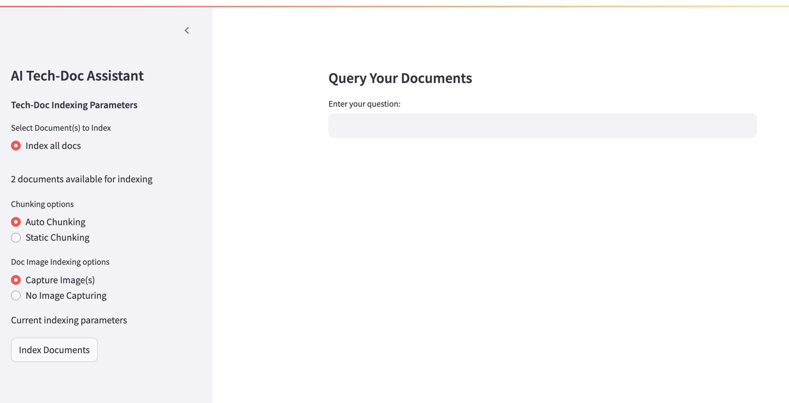
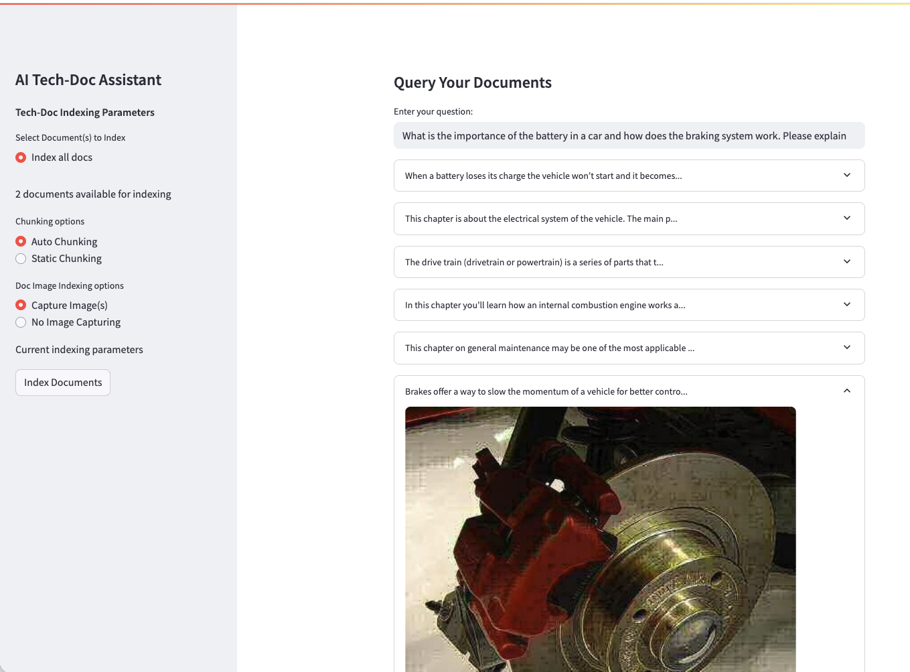

# AI-Tech-Doc-Assistant

## Screenshots

*User Interface with indexing menu and query Input*

*Sample query results with supporting text and image*

*Sample 'AI Assistant' output based on query results context*

*Sample JSON output*

## Overview
Retrieval Augmented Generation (RAG) system to support Q/A of technical documents

## App Features

- **Technical Document Processing & Analysis**: Support PDF and TXT document types using the Unstructured library
- **Streamlit Interface**: Supports Q/A and configurable indexing options

- **Semantic Search**: ChromaDB vector database with sentence-transformers embeddings

- **Multi-Query Decomposition**: Automatically breaks compound questions into sub-queries or a list of queries

- **Cross-Encoder Reranking**: Improves result relevance using ms-marco-MiniLM model

- **PDF Image Extraction**: Captures and displays document images with supporting text

- **JSON Output**: Optional structured output for system integration

- **Named Entity Recognition (Future Version)**:

## App Architecture

###The Indexing Pipeline

### Query Pipeline

**Multi-Query Decomposition**

**Retrieval with Reranking**

**Deduplication of Sub-Queries

**API**
-For this application I used a free version of Groq (model: llama-3.3-70b-versatile)

### Future Optimization
**Hybrid search**: Utilize a combination of keyword and semantic search
**Prompt tuning**: More rigorous evaluation of prompts and perform A/B testing.
**Enable Static chunking options**:

